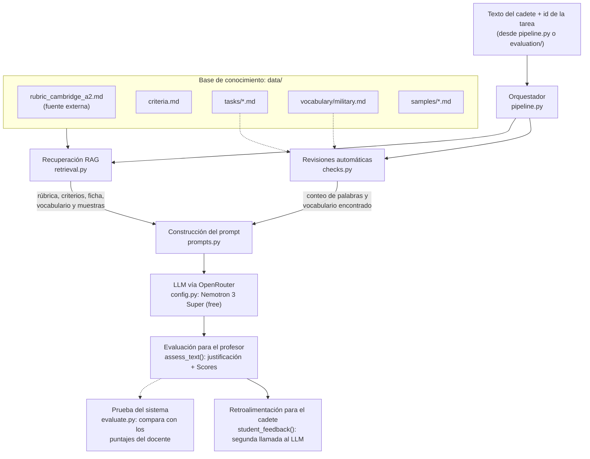

# Sistema para la evaluación de producción escrita de lengua extranjera con LLM y RAG

## Contexto
Enseñanza de inglés en Educación Superior dentro de un contexto militar.
Aproximadamente 180 cadetes por año, distribuidos en 9 secciones.
5 profesores de idioma a cargo de la enseñanza.
Evaluación basada en los criterios del MCER.
Problemática
La rúbrica de Cambridge evalúa Content, Organization y Language en bandas de 0 a 5.
La rúbrica es demasiado genérica para el contexto militar.
No contempla adecuadamente el vocabulario y situaciones propias de la formación militar.
Los docentes deben interpretar y adaptar los criterios según su propio criterio.
Esto genera inconsistencias en los puntajes entre docentes y entre distintas evaluaciones.

## Propósito

Este proyecto busca reducir esa inconsistencia de dos formas:

1. **Formalizando los criterios institucionales** en un documento explícito (`data/criteria.md`).
2. **Usando un LLM con RAG** que, para cada texto, recupere la rúbrica, los criterios, la ficha de la tarea y muestras ya calificadas por el docente, con el fin de evaluar un texto basándose solo en esos documentos.

El sistema es una herramienta de apoyo: la calificación final siempre la decidirá el profesor.

## Estructura del proyecto

```
english-feedback-rag/
├── config.py            # Conexión con OpenRouter y modelo utilizado
├── retrieval.py         # Recuperación RAG desde la base de conocimiento
├── checks.py            # Revisiones automáticas (extensión y vocabulario)
├── prompts.py           # Prompts del profesor y del cadete
├── pipeline.py          # Orquestador: une todos los componentes
├── evaluate.py          # Compara los puntajes del sistema con los de la profesora
├── requirements.txt     # Librerías necesarias
├── data/                # Base de conocimiento
│   ├── rubric_cambridge_a2.md   # Rúbrica oficial de Cambridge (fuente externa)
│   ├── criteria.md              # Criterios institucionales
│   ├── tasks/                   # Una ficha por tarea
│   ├── vocabulary/              # Vocabulario adicional (military.md)
│   └── samples/                 # Muestras calificadas y justificadas
├── evaluation/          # Textos de prueba con los puntajes originales de la profesora
└── results*/            # Evaluaciones completas generadas por el sistema
```

## Arquitectura
 



## Componentes principales

**`config.py`** crea el cliente de OpenRouter a partir de la clave guardada en `.env` y define el modelo (`MODELO`). Solo se aceptan modelos gratuitos (terminados en `:free`), para evitar costos por error.

**`retrieval.py`** implementa la recuperación. La rúbrica y los criterios se incluyen siempre; la ficha de la tarea, su vocabulario adicional y sus muestras calificadas se recuperan filtrando por el campo `Task:` de cada archivo (filtrado por metadatos). Se eligió este método en lugar de búsqueda por similitud porque el profesor siempre sabe a qué tarea corresponde un texto, lo que hace la recuperación exacta.

**`checks.py`** calcula con código dos hechos objetivos: el número de palabras respecto de la extensión esperada (incluido el umbral del 80% del mínimo) y el vocabulario enseñado presente en el texto. Estas revisiones se hacen con código y no con el LLM porque los modelos de lenguaje cuentan mal y estas reglas requieren exactitud.

**`prompts.py`** contiene los dos prompts del sistema:
- **Evaluación para el profesor:** el modelo actúa como examinador, se basa solo en los documentos entregados, revisa cada criterio por separado, cita al estudiante textualmente y escribe las justificaciones antes de los puntajes (chain of thought). Termina con una línea `Scores:` que el código puede leer.
- **Retroalimentación para el cadete:** a partir de la evaluación del profesor, el modelo actúa como tutor y escribe en español, con dos fortalezas, dos o tres aspectos a mejorar con ejemplos corregidos y un consejo final, sin mencionar puntajes.

**`pipeline.py`** coordina el flujo completo: revisiones, recuperación, construcción del prompt, llamada al LLM, lectura de los puntajes y generación de la retroalimentación para el cadete.

**`evaluate.py`** evalúa cada texto de `evaluation/`, compara los puntajes del sistema con los puntajes originales de la profesora (aceptando rangos como "2.5 or 3") y muestra un resumen: coincidencias, diferencias de 0,5 banda o menos y diferencia promedio. Guarda cada evaluación completa en `results/`.


## Diseño de los prompts
 
El sistema usa dos prompts encadenados, definidos en `prompts.py`. Cada uno tiene un **mensaje de sistema** fijo (rol, reglas y formato) y un **mensaje de usuario** que se construye en cada evaluación con la información recuperada.
 
**1. Evaluación para el profesor**
 
- **Rol:** profesor de inglés y examinador en una academia militar chilena.
- **Anclaje en los documentos (grounding):** el modelo recibe cada fuente dentro de una etiqueta (`<rubric>`, `<institutional_criteria>`, `<task_sheet>`, `<extra_vocabulary>`, `<benchmark_samples>`, `<automatic_checks>`, `<student_text>`) y debe basarse solo en ellas, no en su propio conocimiento de Cambridge. Si los criterios y la rúbrica difieren, prevalecen los criterios.
- **Few-shot por recuperación:** las muestras calificadas de la misma tarea funcionan como ejemplos que calibran los puntajes.
- **Reglas de evaluación:** cada criterio se evalúa por separado, cada error se penaliza en un solo criterio y los puntos de contenido se revisan uno por uno, indicando si son esenciales o accesorios.
- **Evidencia:** las citas del estudiante se copian textualmente y entre comillas.
- **Chain of thought:** primero se escriben las justificaciones y al final la línea `Scores: Content X | Organization X | Language X`, que el código lee automáticamente.
- **Seguridad:** el texto del estudiante se trata solo como contenido a evaluar; se ignoran instrucciones que contenga (prompt injection).
- **Temperatura 0,2**, para priorizar la consistencia.
  
**2. Retroalimentación para el cadete**
 
- **Rol:** tutor amable y motivador.
- **Entrada:** la ficha de la tarea, el texto del estudiante y la evaluación del profesor. Al basarse en esa evaluación, nunca la contradice.
- **Formato:** en español, dos fortalezas, dos o tres aspectos a mejorar con el formato "Escribiste / Mejor" (corrección en inglés) y un consejo final, en máximo 200 palabras.
- **Sin puntajes:** no menciona bandas ni notas (el profesor debe validar los puntajes)
- **Temperatura 0,5**, para un tono más natural.
Para ver el mensaje completo que recibe el modelo, ejecutar `python prompts.py`.


## Cómo ejecutarlo

1. Crear y activar el entorno virtual, e instalar las librerías:
   ```bash
   python3 -m venv .venv
   source .venv/bin/activate
   pip install -r requirements.txt
   ```
2. Crear un archivo `.env` en la carpeta principal con una clave de OpenRouter:
   ```
   OPENROUTER_API_KEY=sk-or-v1-...
   ```
3. Ejecutar:
   ```bash
   python retrieval.py    # Muestra las tareas y muestras disponibles
   python checks.py       # Muestra las revisiones automáticas de los textos de evaluation/
   python prompts.py      # Muestra el prompt completo que recibe el LLM
   python pipeline.py     # Evalúa un texto de prueba y genera ambas retroalimentaciones
   python evaluate.py     # Compara el sistema con los puntajes de la profesora
   ```

El modelo utilizado en la versión final es `nvidia/nemotron-3-super-120b-a12b:free`. Al ser un modelo con razonamiento, cada evaluación puede tardar varios minutos.


## Decisiones, resultados y limitaciones
 
### Decisiones y su justificación
 
| Decisión | Por qué |
|---|---|
| Mantener la rúbrica de Cambridge y agregar `criteria.md` | La rúbrica es el estándar oficial; los criterios escritos resuelven los vacíos que hoy cada profesor interpreta a su manera. |
| Recuperar por filtrado de metadatos (`Task:`) en vez de similitud | El profesor siempre sabe a qué tarea pertenece el texto, así que el filtrado es exacto y nunca mezcla tareas. |
| Fragmentar la base manualmente (un archivo por tarea y por muestra) | Cada muestra se recupera completa: texto, puntajes y justificación juntos. |
| Muestras con justificación escrita | Enseñan al modelo *por qué* se asigna cada banda, no solo el número. |
| Conteo de palabras y vocabulario con código | Los LLM cuentan mal y las reglas del 80% y del vocabulario enseñado exigen exactitud. |
| Justificación antes del puntaje | Obliga al modelo a razonar sobre la evidencia antes de decidir (chain of thought). |
| Dos prompts encadenados | La retroalimentación del cadete se basa en la evaluación del profesor y no puede contradecirla. |
| Textos de evaluación separados de `data/` | El modelo nunca ve el puntaje del texto que evalúa, así la comparación es válida. |
| Modelo gratuito (Nemotron 3 Super) | Sin costo para la institución; Qwen y Gemma no estaban disponibles (saturados). |
 
### Resultados
 
- En su mejor ejecución, Nemotron coincidió con el docente en el 67% de los puntajes y el 83% difirió en 0,5 banda o menos (diferencia promedio 0,38). 
- MiniMax M3 (usado por error en su versión de pago durante el desarrollo) fue muy estable, pero sistemáticamente más estricto que la profesora.
- Los textos de desempeño medio obtuvieron puntajes estables (las variaciones más notorias se concentraron en el texto de mejor desempeño y en los casos límite entre dos bandas)
- Parte de las diferencias proviene de los criterios y no de la IA: la corrección original puede depender de impresiones o decisiones arbitrarias humanas, mientras el sistema aplica el descriptor y la regla del saludo de forma más objetiva.
- Todo el desarrollo con el modelo de pago costó USD 0,16.
### Evidencias
 
- `evaluate.py` compara los puntajes del sistema con los puntajes originales del docente en textos que el sistema no usa como referencia, y entrega métricas por criterio.
- Las carpetas `results*/` guardan cada evaluación completa, lo que permite verificar la justificación detrás de cada puntaje.
- Las justificaciones son trazables: citan al estudiante, recorren los puntos de contenido y nombran la regla aplicada. 
### Limitaciones
 
- **Variabilidad:** el mismo texto puede recibir puntajes distintos entre ejecuciones, con saltos de hasta dos bandas en casos difíciles. Por eso el sistema no debe asignar notas sin revisión docente.
- **Datos acotados:** la evaluación usó cuatro textos de una sola tarea y los puntajes de una sola docente; dos muestras de la tarea sobre Santiago son sintéticas.
- **Ajuste sobre los mismos textos:** los criterios se refinaron observando los resultados de esos cuatro textos, y algunos ajustes tuvieron efectos secundarios.
- **Modelos gratuitos:** son lentos, consumen una cantidad impredecible de tokens y a veces no están disponibles.
- **Interfaz por desarrollar:** el texto y la tarea se entregan desde el código o desde `evaluation/`.
## Trabajo futuro
 
- Crear una interfaz para el docente (por ejemplo, con Streamlit) que permita ingresar el texto, elegir la tarea y revisar los puntajes antes de entregar la retroalimentación al cadete.
- Incorporar más tareas, más muestras de referencia en todos los niveles y puntajes de varios profesores, para comparar la variabilidad del sistema y probar si los resultados se vuelven más estables.
## Privacidad
 
Los textos de los estudiantes se anonimizan antes de incluirse en el proyecto y de enviarse al proveedor del modelo. La clave de OpenRouter se guarda en `.env`, que no se incluye en el repositorio. El repositorio es privado.
 
